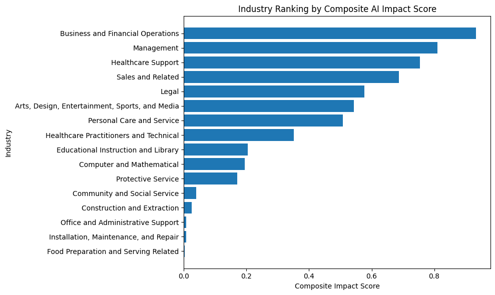
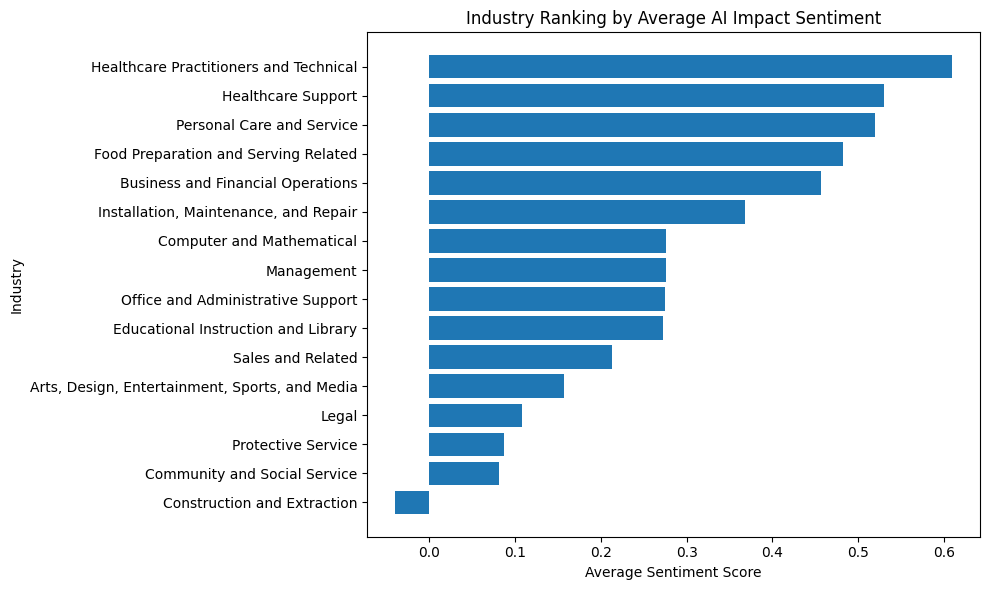
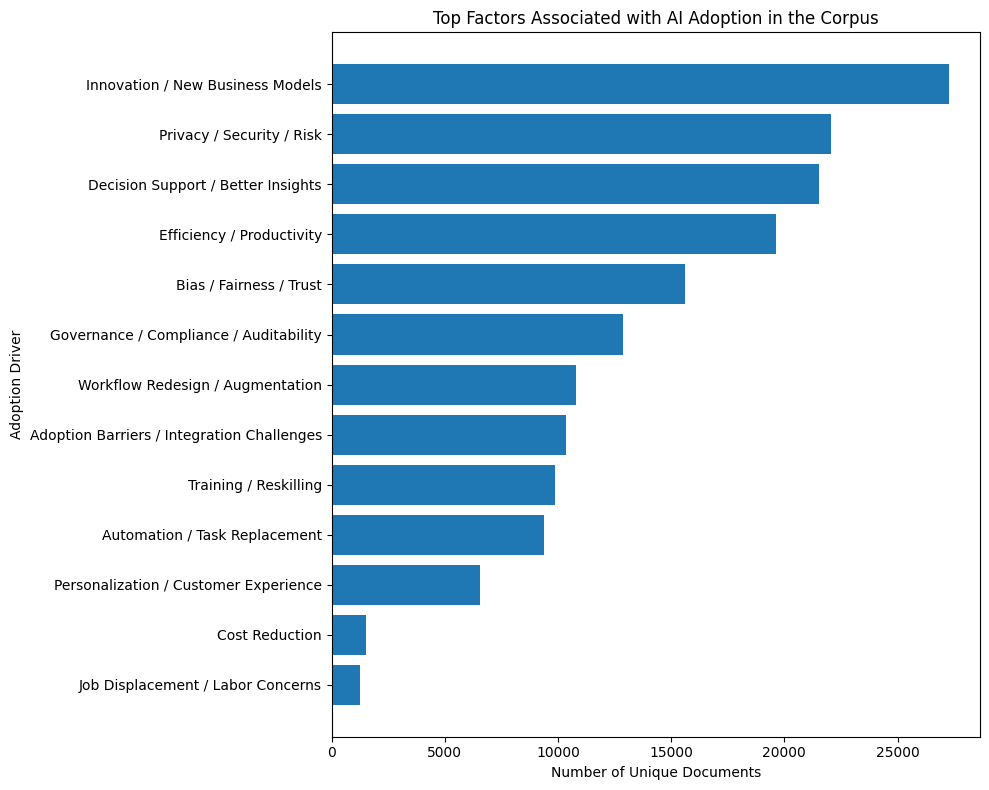
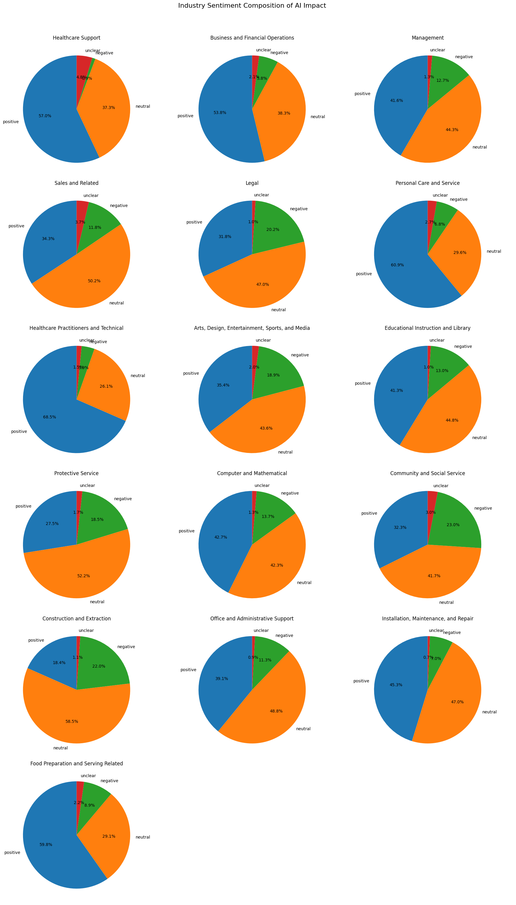
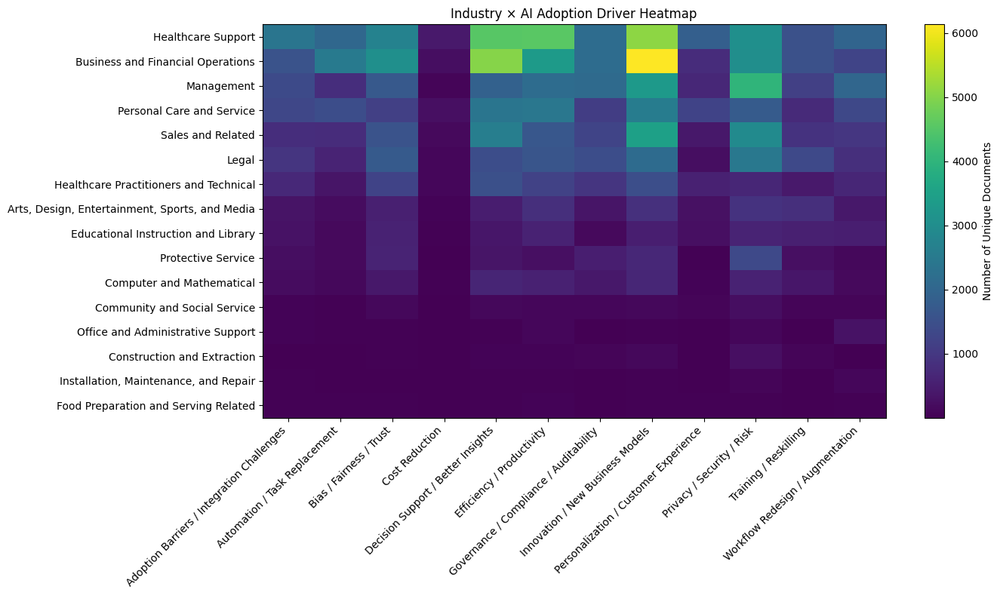
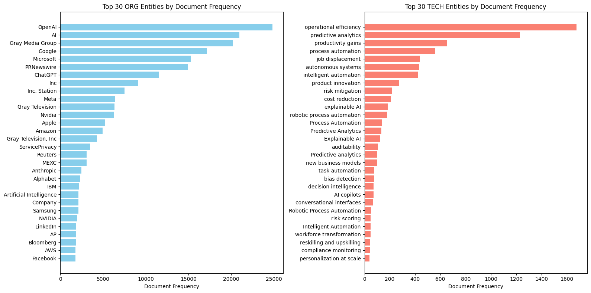
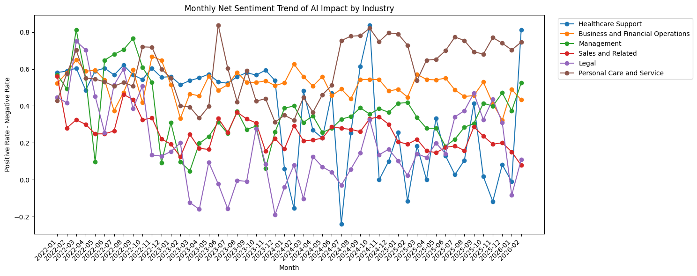

# Where Is AI Actually Landing? An NLP Pipeline Across 200K News Articles

A personal end-to-end NLP project that mines **~200K news articles** to answer three questions about the real-world impact of AI:

1. **Which industries and companies are most exposed to AI?**
2. **In what *direction* — positive, negative, or unclear — is the coverage tilting?**
3. **What technologies and adoption drivers are powering (or blocking) that shift?**

The pipeline runs from raw web-crawl text through topic modeling, entity extraction, weakly-supervised sentiment fine-tuning, and multi-level aggregation, producing the kind of industry-level insights you'd actually take to a strategy meeting.

---

## Headline Findings

### Industries ranked by composite AI-impact exposure

A composite score weighting document coverage (40%), context volume (30%), unique organizations (20%), and unique AI technologies (10%) puts **Business & Financial Operations**, **Management**, and **Healthcare Support** at the top of the AI-exposure ranking. Construction, food prep, and installation/repair sit at the bottom — consistent with the Goldman Sachs / Moravec's-Paradox view that physical-world labor is the slowest to be touched.



### Sentiment is *not* uniformly positive

When fine-tuned RoBERTa scores entity-level sentiment across the corpus, healthcare-adjacent industries trend most positive while **Construction & Extraction** is the only category with net-negative coverage — almost entirely framed around displacement and adoption barriers.



### What's driving the conversation

Rule-based extraction over 13 adoption-driver categories shows **Innovation / New Business Models** and **Privacy / Security / Risk** dominating the discourse — far more than cost reduction or job displacement, contradicting the popular "AI = layoffs" framing.



### Sentiment composition by industry

Per-industry sentiment mix from a fine-tuned RoBERTa model (4-class: positive / neutral / negative / unclear). Healthcare Support, Healthcare Practitioners, and Personal Care skew most positive; Construction & Extraction and Legal carry the largest negative shares.



### Industry × Adoption-Driver intensity

Heatmap of where each adoption driver shows up most strongly. Business & Financial Ops dominates the *Innovation / New Business Models* corridor; Management leads on *Privacy / Security / Risk*; Healthcare Support is the standout on *Decision Support / Better Insights*.



### Top organizations and technologies surfaced

Hybrid entity extraction (DistilBERT-NER for organizations, spaCy `PhraseMatcher` over a curated 65-term lexicon for technologies) reveals the expected "AI Big 7" — OpenAI, Google, Microsoft, Meta, NVIDIA, Apple, Amazon — alongside surprising depth on adoption themes (operational efficiency, predictive analytics, productivity gains, process automation).



---

## Headline Numbers

| Metric | Value |
|--------|-------|
| Articles ingested | ~200,000 |
| AI-relevant articles after filtering | ~180,000 |
| BERTopic topics discovered | 40+ |
| Industry labels assigned | 22 |
| Organizations extracted | thousands (top 30 tracked) |
| Technology terms in lexicon | 65 |
| Weakly-labeled training contexts | 50,000 |
| **RoBERTa val accuracy** | **80.4%** |
| **RoBERTa weighted F1** | **0.806** |
| Adoption-driver categories | 13 |

---

## Pipeline Overview

```
raw parquet (~200K articles)
  └── 01 audit ────────────► quality profile, domain stats, time-series volume
  └── 02 clean & filter ──► ~180K AI-relevant docs (regex + relevance scoring + dedup)
  └── 03 BERTopic ─────────► 40+ topics → mapped to 22 industries via cosine similarity
  └── 04 entities ─────────► orgs (DistilBERT-NER) + technologies (spaCy PhraseMatcher)
  └── 05 sentiment train ──► RoBERTa fine-tune on 50K weakly-labeled contexts
  └── 06 sentiment infer ──► 4-class entity-level sentiment + industry/time aggregations
```

### Methodology highlights

| Stage | Technique | Notable choices |
|------|-----------|-----------------|
| Cleaning | regex paragraph extraction + 2-tier relevance scoring | high-signal × 2 + support × 1, threshold + token-count gate |
| Topics | BERTopic w/ `all-MiniLM-L6-v2` + UMAP(20) + HDBSCAN(min=200) | topics mapped to 22 industries via mean-anchor cosine similarity |
| Entities (orgs) | `dslim/distilbert-NER`, batched GPU inference | 2K-char overlapping chunks, conf ≥ 0.75 |
| Entities (tech) | spaCy `PhraseMatcher`, 65-term lexicon | case-insensitive, lemma-aware |
| Weak labels | OpenAI API, 4-class rubric | ±1-sentence context windows, JSONL cache |
| Sentiment | `roberta-base` fine-tune | class-weighted CE loss, AdamW @ 2e-5, 5 epochs, max-len 256 |
| Inference | continuous score = P(pos) − P(neg) | composite industry-impact score (40/30/20/10) |

### Coverage over time

Monthly net-sentiment trend per industry illustrates how coverage tone shifts with the news cycle (e.g., the dip around early 2024 covering high-profile lawsuits and layoff cycles).



---

## Repository Layout

```
.
├── README.md
├── LICENSE
├── requirements.txt
├── .gitignore
├── notebooks/                       # exploratory / demo notebooks (stage-by-stage)
│   ├── 01_data_audit.ipynb
│   ├── 02_clean_filter.ipynb
│   ├── 03_topic_modeling.ipynb
│   ├── 04_entity_extraction.ipynb
│   ├── 05_sentiment_model_train.ipynb
│   └── 06_sentiment_inference.ipynb
├── src/                             # reusable Python modules
│   ├── config.py                    # paths, constants, lexicons, anchors
│   ├── data/
│   │   ├── audit.py
│   │   └── clean_filter.py
│   ├── topics/
│   │   └── bertopic_pipeline.py
│   ├── entities/
│   │   └── extract.py
│   └── sentiment/
│       ├── context_builder.py
│       ├── weak_label.py            # OpenAI-driven labeling
│       ├── train.py                 # RoBERTa fine-tune
│       └── infer.py                 # batched inference + aggregation
├── scripts/                         # CLI runners for each pipeline stage
│   ├── 01_audit.py
│   ├── 02_clean.py
│   ├── 03_topics.py
│   ├── 04_entities.py
│   ├── 05_train_sentiment.py
│   └── 06_infer_sentiment.py
├── docs/images/                     # result visualizations
├── data/                            # gitignored — regenerated by scripts
└── outputs/                         # gitignored — trained models & artifacts
```

---

## Setup

```bash
git clone https://github.com/<your-username>/<repo>.git
cd <repo>

python -m venv .venv
source .venv/bin/activate

pip install -r requirements.txt
python -m spacy download en_core_web_sm

# Required only for the weak-labeling stage (notebook 05)
export OPENAI_API_KEY="sk-..."
```

A GPU is strongly recommended for stages 04 (NER) and 05/06 (RoBERTa). CPU works for 01–03 but is slow.

---

## Reproducing the Pipeline

Each stage writes its outputs to `data/` for the next stage to consume. You can run the full chain from a clean checkout:

```bash
python scripts/01_audit.py             # profile raw corpus (no transformation)
python scripts/02_clean.py             # 200K → ~180K AI-relevant docs
python scripts/03_topics.py            # BERTopic + topic→industry mapping
python scripts/04_entities.py          # orgs (NER) + technologies (PhraseMatcher)
python scripts/05_train_sentiment.py   # weak labels (OpenAI) + RoBERTa fine-tune
python scripts/06_infer_sentiment.py   # batched inference + aggregations
```

The notebooks under `notebooks/` are the original exploratory artifacts and contain the plots, EDA cells, and qualitative spot-checks that aren't reproduced verbatim by the scripts.

---

## Data Source

The raw corpus (~several hundred MB, ~200K AI/ML/data-science news articles) is **not committed to the repo**. It is downloaded on first run by the audit script from a public Google Cloud Storage bucket:

```python
df = pd.read_parquet(
    "https://storage.googleapis.com/msca-bdp-data-open/"
    "news_final_project/news_final_project.parquet",
    engine="pyarrow",
)
```

Trained model artifacts (the BERTopic safetensors model, the fine-tuned RoBERTa weights) are also gitignored and regenerated by stages 03 and 05 respectively.

---

## License

[MIT](LICENSE)
